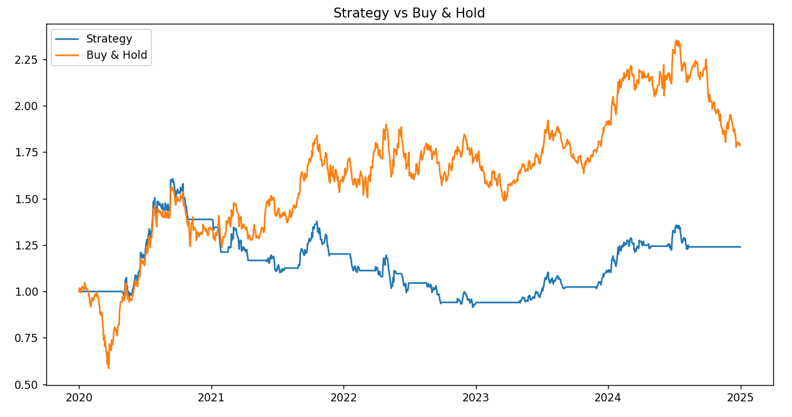
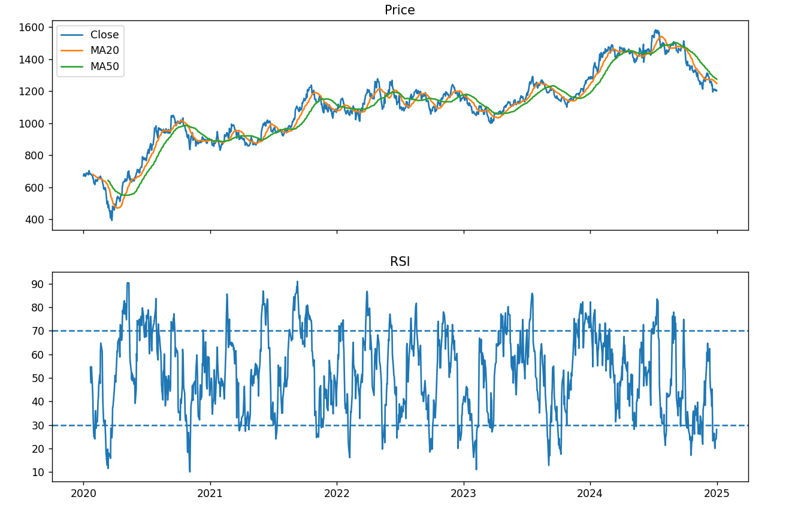
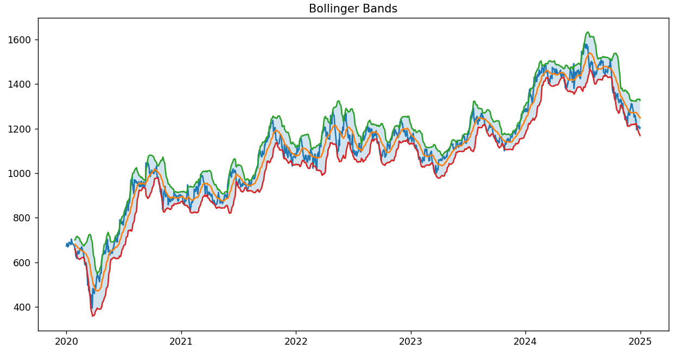

# Quantitative Stock Price Analyzer & Strategy Backtester
A Python-based quantitative finance project that downloads historical stock market data, computes common technical indicators, generates trading signals, backtests a simple moving average crossover strategy, and evaluates its performance against a buy-and-hold benchmark.

---

## Features
* Downloads historical OHLCV data using **Yahoo Finance**
* Calculates:

  * 20-Day Moving Average
  * 50-Day Moving Average
  * Relative Strength Index (RSI)
  * Bollinger Bands
  * Moving Average Spread
  * Moving Average Slopes
* Implements a Moving Average Crossover strategy
* Simulates a trading portfolio with transaction costs
* Computes performance metrics:

  * Total Return
  * Sharpe Ratio
  * Maximum Drawdown
  * Win Rate
  * Trade Count
* Compares the strategy against Buy & Hold
* Generates visualizations for:

  * Portfolio Performance
  * RSI
  * Bollinger Bands

---

## Project Structure
```
Finance Projects/
│
├── main.py
├── config.py
├── data_loader.py
├── indicators.py
├── strategies.py
├── backtester.py
├── metrics.py
├── visualization.py
│
├── results/
├── requirements.txt
└── README.md
```

---

## Installation
Clone the repository and install the required packages.

```bash
pip install -r requirements.txt
```

Run the project with

```bash
python main.py
```

---

## Strategy
The implemented strategy is a simple Moving Average Crossover.

Buy when:

MA20 crosses above MA50.

Sell when:

MA20 crosses below MA50.

A transaction cost is applied to every trade to make the simulation more realistic.

---

## Indicators
### Moving Average
Measures the overall market trend by averaging historical prices.
### Relative Strength Index (RSI)
Measures recent buying and selling momentum.

Traditional thresholds:

* RSI > 70 → Overbought
* RSI < 30 → Oversold

### Bollinger Bands
Measure market volatility using a moving average and rolling standard deviation.

Wide bands indicate increased volatility.

Narrow bands indicate reduced volatility.

---

## Performance Metrics
The framework computes:

* Final Portfolio Value
* Total Return
* Buy & Hold Benchmark
* Sharpe Ratio
* Maximum Drawdown
* Win Rate
* Number of Buy/Sell Signals

---

## Observations
Testing on Reliance Industries (2020–2025) showed that:

* The Moving Average strategy generated a positive return.
* However, it underperformed a Buy & Hold strategy over the same period.
* The strategy produced relatively few large winning trades while many trades resulted in small losses due to market whipsaws.
* Introducing transaction costs reduced overall profitability, highlighting the importance of realistic backtesting assumptions.

---

## Results
### Strategy vs Buy & Hold
The following chart compares the portfolio value of the Moving Average Crossover strategy against a Buy & Hold benchmark over the testing period.

<p align="center">
  
</p>

---

### Relative Strength Index (RSI)

The RSI indicator highlights periods where the stock may have been overbought or oversold.

<p align="center">
  
</p>

---

### Bollinger Bands

Bollinger Bands illustrate market volatility and how price interacts with the upper and lower volatility bands.

<p align="center">
  
</p>
---

## Future Improvements
* Multiple trading strategies
* RSI-based strategy
* Bollinger Band strategy
* MACD implementation
* Parameter optimization
* Multi-stock portfolio backtesting
* Portfolio optimization
* Walk-forward analysis
* Strategy comparison dashboard

---

## Technologies Used
* Python
* Pandas
* NumPy
* Matplotlib
* yfinance

---

## Disclaimer
This project is intended for educational and research purposes only. It is not financial advice.
